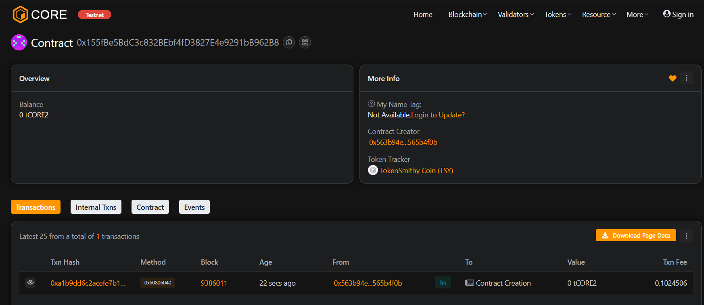

# 💰 TokenSmithy

## 🧩 Project Description
TokenSmithy is a decentralized token creation and management system built on the Ethereum blockchain. It allows the owner to mint tokens, users to transfer them, and others to manage token allowances securely.

---

## 🌐 Project Vision
To empower developers and communities to create and manage their own tokens effortlessly while ensuring trust, transparency, and immutability through blockchain technology.

---

## ⚙️ Key Features
- Mint new ERC-like tokens  
- Secure peer-to-peer transfers  
- Approve and transfer tokens via authorized addresses  
- Owner-based mint control  

---

## 🚀 Future Scope
- Integrate with ERC-20 standard for interoperability  
- Add token burn functionality  
- Implement staking and reward mechanisms  
- Launch DApp interface for token management  
- Introduce DAO-based token governance  

---

## 🧰 Tech Stack
- **Solidity** — Smart Contract  
- **Hardhat** — Ethereum Development Framework  
- **JavaScript** — Testing and Deployment  
- **Ethereum Network** — Decentralized Infrastructure  

---

## 📜 License
This project is licensed under the **MIT License**.

Contract detail : 0x155fBe5BdC3c832BEbf4fD3827E4e9291bB962B8
